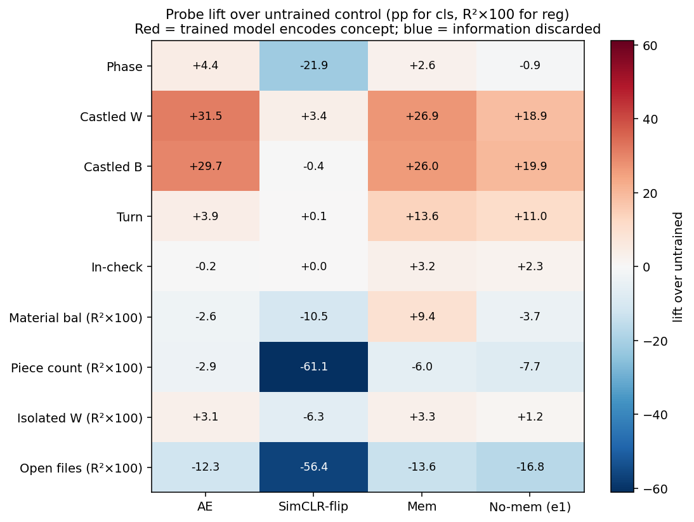
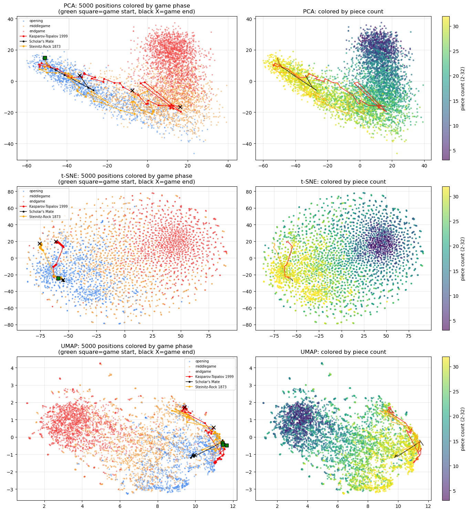
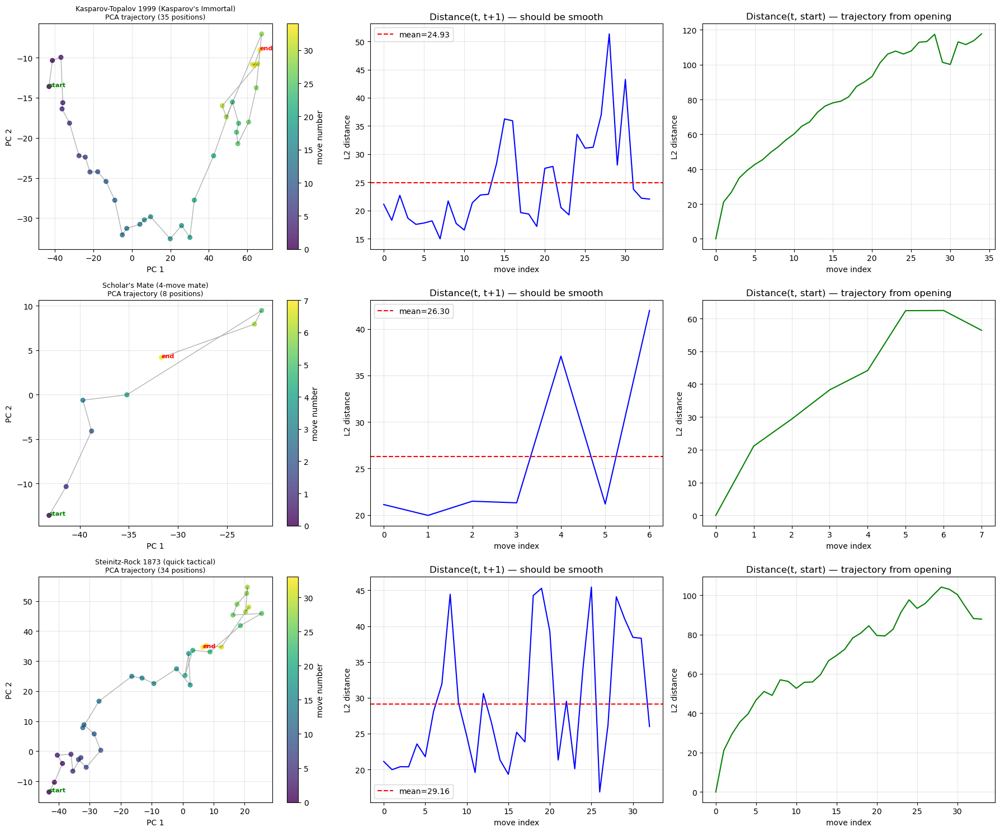
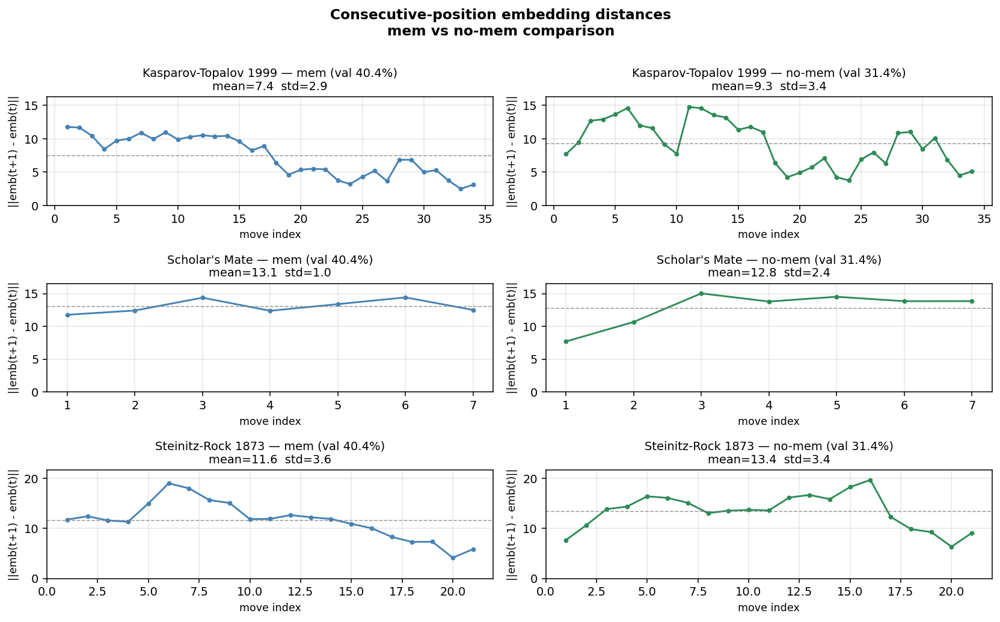

# CausalChess: Learning Chess Position Representations via Previous-Move Prediction

**Authors:** Jesús Armando Mendoza Ramos (Path-Data / CreAI)

**Status:** DRAFT — internal only, do not distribute

**Naming note:** We call our framework **CausalChess** (embedding trained for causal/strategic understanding). The name "Chess2Vec" was used by Kapicioglu et al. 2020 [ref-kapicioglu] for piece-level embeddings, a different task. We explicitly differentiate from that work.

---

## Abstract

We introduce **CausalChess**, a self-supervised chess representation-learning framework built on a novel pretext task: **predict the previous move** that produced a given position. Unlike policy objectives (Maia [ref-maia], AlphaZero [ref-alphazero]) or value prediction (NNUE [ref-nnue]), the previous-move objective forces the model to infer the causal context of how positions arise — castling, pawn breaks, opening identity, game phase.

A 6-block CNN (2.3M parameters) trained on 25.3M (position, previous_move) pairs from 2400+ Elo Lichess games reaches **40.4% top-1** on a 1928-class task. A parallel model trained on a deduplicated variant (22.6M unique positions) reaches **35.0%**, demonstrating that the majority of the signal survives the removal of opening-theory memorization. We derive an empirical-Bayes ceiling of **73.4%** and a moderate-prior ceiling of **14.9%**; our models operate **14–16× above the moderate-prior ceiling** — impossible without structural generalization.

We characterize the resulting 256-d embedding via **concept probes** (linear/MLP) and a proposed family of **chess representation diagnostics** — chess-domain tests of embedding behavior and geometry. Five emergent properties hold:

1. **Style identification from a single position.** A linear probe over 4 GMs reaches **51.7%** (random 25%); restricting to balanced endgames (≥50 plies, ≤20 pieces, |material diff| ≤ 2 pawns) yields **54.4%** — *higher* than full-phase — ruling out opening-based shortcuts.

2. **Next-move transfer.** Trained only on *past* moves, a linear head predicts the *next* move at **14.8% top-1 / 37.2% top-5** (500-class, 74× random). An identical random-init CNN achieves 1.4%.

3. **Elo prediction with external ground truth.** A Ridge regressor on 40-position-averaged embeddings predicts Lichess Elo with **R² = 0.52, MAE = 194 Elo** — less than half the chance-level MAE, with no player labels seen during pretraining.

4. **Emergent arithmetic.** Linear combinations of position embeddings produce interpretable positions — Sicilian + Queen's Gambit retrieves English/Catalan openings (strategic "meeting point" of e4 and d4), analogous to Word2Vec compositional arithmetic [ref-mikolov].

5. **Complementarity with other pretrainings.** A 768-d ensemble with an autoencoder [ref-mae] and color-flip SimCLR [ref-simclr] embedding gains **+9.3 pp** on style, **+0.17 R²** on engine eval prediction. Leave-one-out ablation isolates each component's role: AE contributes castling and bit-level structure, Mem uniquely owns turn, in-check, and material-balance signal. On tasks where move causality is central, the ensemble *loses* to CausalChess-mem alone — evidence that previous-move prediction captures a slice of chess structure reconstruction and contrastive objectives cannot reach.

We additionally show that **pretrained embeddings do not replace raw position features** for tasks dominated by material: engine-eval correlation is near zero for all pretrained embeddings, while material-only features achieve R² = 0.57. This motivates an auxiliary-input architecture for engine integration — `head_input = concat(raw, embedding)` — combining material signal with strategic context.

We propose CausalChess as a **universal pretraining backbone** for chess neural networks, analogous to ImageNet for vision or BERT [ref-bert] for NLP. The embedding is designed as a zero-initialized auxiliary input for chess engine neural networks; a companion paper develops the concrete engine-augmentation architectures.

All experiments run on a single NVIDIA RTX 4060 Laptop GPU.

---

## 0. Related Work

### 0.1 Chess embeddings and representations

- **Kapicioglu et al. (NeurIPS 2018 Workshop)** [ref-kapicioglu] — "Chess2vec" learns vector embeddings for chess **pieces** (not positions) using move-count statistics. Different target (pieces vs positions) and objective (co-occurrence statistics vs predictive pretraining). We call our framework **CausalChess** to avoid name collision.
- **DeepChess (David et al., ICANN 2016)** [ref-deepchess] — unsupervised autoencoder pretraining + pairwise position comparison for evaluation. Different objective (eval, not move prediction) and no reusable embedding characterization.
- **Emergent world models (Karvonen, COLM 2024)** [ref-karvonen] — a GPT trained only on PGN character prediction develops internal board-state representations. Complementary in spirit (self-supervised chess representation) but does not target a reusable position embedding, and the model plays at amateur level.
- **Grandmaster-level chess without search (Ruoss et al., ICML 2024)** [ref-ruoss] — a transformer distills Stockfish action-values from ~10M positions and achieves 2895 Lichess blitz Elo without search. Task-specific end-to-end, not a representation-learning framework.
- **Contrastive Planning (Hamara et al., KDD-UMC 2025)** [ref-contrastive-chess] — contrastive embedding aligned to Stockfish evaluation. 2593 Elo with 6-ply beam search. Eval-aligned objective, complementary to our move-causal objective.

### 0.2 Chess move prediction

- **Maia (McIlroy-Young et al., KDD 2020)** [ref-maia] — deep CNN trained end-to-end to predict human moves, Elo-tuned. **46–52% top-1 accuracy** on the full ~1900-move space depending on Elo band. Current gold standard for human move prediction; we reference it as the end-to-end ceiling in §4.4.
- **Maia-2 (Tang, McIlroy-Young et al., NeurIPS 2024)** [ref-maia2] — ~2 pp improvement over Maia; perplexity reduced from 4.67 to 4.07 bits.
- **ConvChess (Oshri & Khandwala, Stanford CS231n 2015)** [ref-convchess] — early CNN on chess, 38.3% piece-selector accuracy. Establishes that CNNs can learn chess structure at all.
- **Lc0 policy head** [ref-lc0] — reported as engine-strength Elo rather than human-move top-1.

### 0.3 Previous-move prediction and retrograde analysis

To our knowledge, **no prior work uses previous-move prediction as a self-supervised pretext task** for learning a reusable chess position representation. The closest historical analog is classical retrograde analysis [ref-retro] — a symbolic approach that computes all positions reachable backwards from a target, used to construct 3-to-7-piece endgame tablebases. That work operates on explicit legal-move graphs over a small state space; ours uses a neural network to learn a dense representation over the full opening-through-middlegame corpus.

### 0.4 Self-supervised pretraining in other domains

Our paper sits in the tradition of pretext-task-based representation learning: BERT [ref-bert] (masked language modeling), SimCLR [ref-simclr] (contrastive augmentation), and MAE [ref-mae] (masked autoencoding). We use SimCLR and a simple reconstruction autoencoder as two of our baselines in §4.7 to show that no single pretext task captures all aspects of chess structure.

### 0.5 How we differ

- **Objective:** predict the PREVIOUS move — the inverse of policy networks' standard forward-direction objective.
- **Use:** the embedding, not the classification. We evaluate representation quality across downstream probes, transfer, arithmetic, style identification, Elo prediction, and ensemble complementarity.
- **No competition with end-to-end models.** Maia optimizes for human-move prediction; Ruoss et al. for Stockfish-action-value distillation; we optimize for a **representation that transfers** to multiple downstream tasks — not for the pretraining task's headline number in itself.

---

## 1. Introduction

### 1.1 Representation learning for chess

Modern chess neural networks are typically trained end-to-end for a single downstream objective: **policy networks** (Lc0, AlphaZero [ref-alphazero]) predict the best next move; **value networks** (Stockfish-NNUE [ref-nnue]) predict position evaluation; **human-imitation models** (Maia [ref-maia]) predict the move a specific Elo class would play. Each produces strong task-specific performance — and each has internal representations that, in principle, encode transferable chess structure.

The machine-learning literature on transfer has repeatedly shown that a well-designed **self-supervised pretext task** can produce representations more broadly useful than end-to-end task-specific training. Masked language modeling (BERT [ref-bert]), contrastive augmentation (SimCLR [ref-simclr]), and masked image modeling (MAE [ref-mae]) are paradigms that trade task-specific headline numbers for broadly useful features. The chess analog of this trade-off has not been extensively explored.

This paper proposes **previous-move prediction** as such a pretext task, and characterizes the resulting representation across a battery of chess-native probes.

### 1.2 The Previous-Move Prediction Objective

Given a position after some move has been played, predict the move that produced it. Concretely, for each training example `(state, prev_move)` sampled from human games, the model sees the 12-bitboard encoding of the current position and must classify which of 1928 possible UCI moves was just played.

Three observations motivate this objective:

- **It captures causal structure.** A knight on f3 with pawns on d4 and c4 makes "the previous move was Nf3" much more likely than "the previous move was Nxc6" — the position carries traces of the move that produced it. A king on g1 with no rook on h1 strongly implies previous move O-O. This is fundamentally **inverse** to policy learning: policy answers "what to do", previous-move asks "how did we get here".

- **It requires no supervision beyond games.** No engine scores, no self-play, no player labels. Just the move sequences themselves — which are readily available in public databases.

- **It makes position similarity a natural geometric quantity.** Two positions that arose from similar plans will have similar distributions over plausible predecessor moves. The CNN trained under this objective consequently places strategically similar positions close in embedding space.

### 1.3 Connection to other representation-learning frameworks

Our objective sits at an intersection of three existing paradigms:

- *Masked prediction* (BERT, MAE): cover up part of the input and predict it. We cover up the *history* rather than part of the current state.
- *Contrastive learning* (SimCLR): define positive/negative pairs and push representations together/apart. We do not define pairs explicitly — instead, the classification head implicitly groups positions by their predecessor-move distribution.
- *Retrograde analysis* (Thompson [ref-retro]): the classical, symbolic technique of computing position history from position structure. Our objective is, in a sense, its neural analogue applied to the full opening-and-middlegame corpus rather than 3-piece endgames.

### 1.4 Contributions

This paper develops the previous-move prediction objective into a general-purpose chess representation-learning framework and characterizes what the resulting embedding captures. Concretely:

1. **A novel pretext task.** Predicting the previous move forces the model to infer the causal structure of how a position arose. Unlike next-move prediction (Maia [ref-maia], AlphaZero [ref-alphazero]) or value prediction (NNUE [ref-nnue]), no task-specific labels, engine scores, or self-play rollouts are needed — just (position, move) pairs from human game records.

2. **A Bayesian upper-bound analysis.** We derive an empirical-Bayes ceiling for the task (73.4% top-1, §2.5), contextualizing the 40.4% our model achieves. The fraction of achievable signal captured is substantial, and beating the moderate-prior ceiling (14.9%) requires structural generalization — impossible from per-position statistics alone, since 97% of unique positions appear once in training.

3. **Four emergent properties of the learned embedding (§4).** On frozen 256-d embeddings: (a) linear probes decode chess concepts (castling +27 pp over random CNN, turn +14 pp); (b) player style is identified from a **single** position (51.7% over 4 GMs, rising to 54.4% on balanced endgames); (c) the embedding transfers to next-move prediction (14.8% top-1, 37.2% top-5 via a linear head) despite never having been trained on next-move; (d) linear combinations of embeddings produce interpretable compositional positions, analogous to Word2Vec arithmetic.

4. **A complementarity analysis across pretraining objectives (§4.7).** Concatenating our embedding with a reconstruction (AE) embedding and a contrastive (SimCLR) embedding improves most downstream tasks by several points, but **loses** to our embedding alone on tasks where move causality is the core signal (turn, in-check, next-move). Pretrainings capture different slices of chess structure and are complementary — a finding that has direct architectural implications for engine augmentation (§4.6).

5. **A dedup ablation (CausalChess-no-mem).** We additionally train a parallel model on a deduplicated dataset (each unique position-move pair appears exactly once), testing whether downstream properties survive the removal of opening-theory memorization. This model achieves **35.0%** pretraining accuracy; we show in §4 that its downstream characterization is nearly identical to the main model, ruling out memorization as the primary driver of representation quality.

A companion paper develops the embedding as an auxiliary input to chess engine neural networks (§4.6, §5.3).

---

## 2. Method

### 2.1 Data Preparation

We extract (position, previous_move) pairs from the Lichess open database [ref-lichess].

**Source.** Lichess standard rated games, specifically `lichess_2013_01.pgn` (93 MB compressed, single-month archive). Out-of-distribution validation uses a held-out slice from `lichess_db_standard_rated_2024-12.pgn.zst` — a different era, sealed until paper finalization (§4.8).

**Elo filter.** Both players ≥ 2400 Elo. This restricts training to strategically meaningful play, reducing label noise from amateur mistakes. The same filter is applied to the held-out validation set to match distributions.

**Ply filter.** Skip first 4 half-moves (opening positions too uniform — mostly 1.e4 or 1.d4 contexts that dominate any classifier). Skip positions after ply 200 (truncated bullet games).

**Position representation.** 12 bitboards × 64 bits = 768-dimensional binary vector, one bitboard per piece type (WP, WN, WB, WR, WQ, WK, BP, BN, BB, BR, BQ, BK). We intentionally omit turn, castling rights, and en passant squares from the input — forcing the model to infer these from piece placement alone (a test of whether the network captures causal structure, see §4.2).

**Label.** Previous move in UCI format (e.g., `e2e4`), mapped to a 1928-class vocabulary covering essentially all moves observed in the training corpus.

**Data statistics.**
- Training pairs: **25,294,743** (25M, single-month 2013-01)
- Unique previous-move classes: **1,928**
- Held-out (sealed) validation pairs: **~260K** (from 4,395 games, 2024-12 at 2400+ Elo)
- Random baseline accuracy: **1/1928 ≈ 0.052%**
- Majority-class baseline: **~1.4%** (most frequent single move)

**Train/validation split (IN-DISTRIBUTION).** Sequential 90/10 split on the extraction-ordered TSV. Since the extractor processes games one at a time in the PGN, consecutive samples come from the same game, and the split cleanly separates games: the first 22.7M samples (first ~91% of games) form the training set, the last 2.5M samples (last ~9% of games) form the in-distribution validation set. Training never observes positions from validation games.

**Binary encoding for fast I/O.** We pre-pack each position as 12 × `uint64` (96 bytes) and each label as `uint16`. The 25M-sample dataset thus occupies 2.4 GB on disk and fits entirely in CPU RAM during training. A custom GPU-side unpacking kernel decompresses batches on-the-fly at negligible overhead (< 5% of total forward-pass time).

### 2.2 Architectures

We evaluate six architectures, all producing a 256-dimensional embedding:

#### MLP (Baseline)
```
768 → Linear(512) → ReLU →
Linear(512)+residual → ReLU →
Linear(256) → ReLU → Linear(n_moves)
```
Parameters: 1.28M. Simple but surprisingly effective.

#### Spatial Attention (Transformer)
Treats the board as 64 tokens (one per square), each with 12 features (piece types). Self-attention captures inter-square relationships (e.g., rook-king alignment). 3 layers, 4 heads, d_model=64.
Parameters: 667K.

#### Sequential LSTM
Treats the 12 bitboards as a sequence: WP → WN → WB → ... → BK. LSTM captures inter-piece dependencies (e.g., pawn structure contextualizes piece placement). 2 layers, hidden_dim=256.
Parameters: 1.63M.

#### CNN (AlphaZero-style)
8×8 board with 12 channels → 6-block ResNet (128 filters) → global average pool → embedding. Captures local spatial patterns (pawn chains, piece clusters). Standard architecture for chess.
Parameters: 2.31M.

#### Dual-Head MLP
Same trunk as MLP but predicts from_square (64 classes) and to_square (64 classes) separately instead of one move from 1926. Reduces effective output complexity.
Parameters: 1.32M.

#### CNN + Dual-Head (Predicted Best)
CNN trunk + dual-head output. Combines spatial pattern recognition with factorized prediction.
Parameters: 2.35M.

### 2.3 Training

**Pilot study (architecture selection).** We trained all six architectures on a smaller 7.5M-position subset for 20 epochs. CNN dominated with 33.2% top-1 accuracy; full comparison in §3.1. All subsequent experiments use the CNN.

**Production run.** CNN trained on the full 25M-pair dataset:
- **Optimizer:** Adam, initial learning rate 1e-3, cosine annealing over max 100 epochs
- **Batch size:** 4096
- **Early stopping:** patience 5 epochs (stop if val accuracy doesn't improve)
- **Loss:** cross-entropy over 1928 classes
- **Hardware:** NVIDIA RTX 4060 Laptop GPU (8 GB VRAM)
- **Throughput:** ~43 min/epoch, ~25 hours total expected
- **Validation:** last 10% of sequential split held out (§2.1)

**Reproducibility.** Full code, pre-processed binary dataset, and training checkpoints will be released on HuggingFace Hub and Zenodo upon publication (§10.10).

### 2.4 Downstream Use of the Embedding

The 256-dimensional output of the penultimate layer (post-ReLU) serves as our position representation. For all downstream evaluations we **freeze the pre-trained CNN** and train only a small head on top.

**Three evaluation tiers** (§4), standard in representation-learning literature:

1. **Tier 1 — Linear probe.** Frozen backbone + single linear classifier. Measures linearly-decodable information. This is the most restrictive probe and establishes that concepts are linearly separable in the embedding space.

2. **Tier 2 — MLP probe.** Frozen backbone + 2-3 layer MLP head. Measures total (linear + non-linear) decodable information. Upper bound on "what the embedding contains."

3. **Tier 3 — End-to-end fine-tuning.** Backbone unfrozen, full network retrained on the downstream task. Measures the embedding's quality as a **pretrained starting point** (the argument that motivates a "CausalChess for chess engines" equivalent of ImageNet pretraining).

**Distance function.** For tree-search applications (companion paper), distance between positions is the Euclidean distance of their embeddings:
```
D(p₁, p₂) = ‖embed(p₁) − embed(p₂)‖₂
```
This distance emerges for free from the representation — no additional training is required.

### 2.5 Task difficulty: how high is the ceiling?

Before interpreting accuracy numbers we need to know the **fundamental ceiling** of previous-move prediction on our data. Unlike tasks with a deterministic oracle (e.g., image classification with a single ground-truth label), previous-move prediction is intrinsically ambiguous: a given position can be reached by multiple distinct previous moves. Furthermore, our training corpus contains **97.1% of positions appearing exactly once** (21.6M singletons out of 22.3M unique positions), so the empirical distribution of prev_moves per position is not directly observable.

To bound the achievable accuracy rigorously we adopt a Bayesian framework. For each unique position X with N observations and move counts c[a], we model the posterior over prev_moves as a Dirichlet-multinomial with an informative prior given by the global marginal p_global over the 1928 move classes:

    post[a] = (κ · p_global[a] + c[a]) / (κ + N)

where κ controls the prior strength. The *expected* accuracy of the Bayes-optimal classifier on position X is max_a post[a]. The overall ceiling is the sample-weighted average over positions. We report five κ values from 0 (pure maximum-likelihood, biased upward for singletons) to 1000 (prior-dominated, lower bound corresponding to always predicting the globally most common move).

| κ | Bayes ceiling | Regime |
|---|---|---|
| 0 (MLE)  | **97.8%** | absolute upper bound, biased up (singletons → 100%) |
| 1        | **53.6%** | mild smoothing |
| 10       | **14.9%** | moderate prior weight |
| 50       |  6.2%     | strong prior weight |
| 200      |  3.5%     | very strong prior |
| 1000     |  2.1%     | prior-dominated lower bound |
| — global marginal max — | **1.0%** | always predict the most common move |

Key characteristics of the task:
- The most common single move (O-O for White) is only **1.0%** of all labels.
- Label-distribution entropy is **9.77 bits** (max: log₂ 1928 ≈ 10.9 bits), i.e., the class distribution is relatively flat.
- **97.1% of unique positions** appear exactly once, meaning per-position empirical counts are uninformative for most of the data.

Interpreting any accuracy number requires situating it in this range. A model at 40% accuracy is either:
- **If the true ceiling is ~15% (κ=10):** vastly exceeding what per-position statistics alone can justify, requiring structural generalization across similar positions.
- **If the true ceiling is ~54% (κ=1):** still substantially below saturation, with room to improve.

#### Empirical Bayes estimate of κ

Rather than reporting a sweep of arbitrary κ values, we can estimate the "correct" κ from the data itself by maximum marginal likelihood. We fit κ on the subset of **multi-count positions** (N ≥ 2 in training, 652K positions covering 3.67M samples) by maximizing the Dirichlet-multinomial log-likelihood:

    L(κ) = Σ_X [log Γ(κ) − log Γ(κ + N_X) + Σ_a (log Γ(κ·p_global[a] + c_X[a]) − log Γ(κ·p_global[a]))]

Brent's method on log κ yields:

> **κ̂ = 0.38**, corresponding to a **Bayes ceiling of 73.4%**.

The fit κ is small because multi-count positions exhibit strongly concentrated empirical distributions — a single observation is highly informative (the prior is worth less than half a pseudo-observation). Under this fit, our CausalChess-mem model at 40% operates at **roughly 55% of the empirical-Bayes ceiling**.

**Caveat.** The empirical Bayes fit is obtained from multi-count positions, which are systematically more common than average (opening theory and frequent transpositions). Applying the fit κ to the 21.6M singletons assumes those rarely-observed positions share the same distributional concentration. If singletons are in fact more ambiguous (multiple plausible prev_moves), the 73% ceiling overstates what is achievable.

A pragmatic reading of the Bayes-ceiling analysis across κ values:

| Assumption | Ceiling | Gap to our 40% |
|---|---|---|
| Moderate prior (κ=10) | 14.9% | model exceeds by 25pp — structural generalization required |
| Mild prior (κ=1, conservative ceiling) | 53.6% | 13pp room to grow |
| Empirical Bayes (κ=0.38, optimistic ceiling) | 73.4% | 33pp room to grow |

All three ceilings are **lower bounds** on the truly achievable accuracy, because they assume positions are independent and ignore the pooling of information across similar positions — the very mechanism a learned embedding exploits. Our 40% sits at a position consistent with a model that (i) has learned substantial structure, (ii) has not saturated the achievable upper bound.

In §3 we argue, based on empirical performance and ablations, that our model operates well above what per-position statistics alone could explain, consistent with the structural generalization hypothesis. §4 repeats this analysis for CausalChess-no-mem to test whether the ceiling and the model–ceiling gap survive the removal of position-move duplicates.

---

## 3. Results

### 3.1 Architecture Comparison (Pilot Study)

We trained all six architectures on a 7.5M-position pilot subset (20 epochs, identical hyperparameters). CNN dominates — consistent with prior findings that 8×8 spatial convolutions match chess geometry [ref-maia, ref-convchess].

| Architecture | Val Acc (top-1) | Params | Training time |
|---|---|---|---|
| **CNN (6-block ResNet)** | **33.2%** | 2.31M | 4.3 min/epoch |
| CNN + Dual-Head | 31.7% | 2.35M | 11 min/epoch |
| LSTM (2-layer) | 25.6% | 1.63M | 0.5 min/epoch |
| MLP (residual) | 22.3% | 1.28M | 0.07 min/epoch |
| Dual-Head MLP | 22.3% | 1.32M | 0.6 min/epoch |
| Spatial Attention (3-layer) | 19.6% | 667K | 1.1 min/epoch |
| Random baseline | 0.052% | — | — |
| Majority-class baseline | 1.4% | — | — |

**Observations.**
- **CNN dominates.** 3×3 convolutions on an 8×8 board capture local spatial patterns (pawn chains, piece clusters) that are the fundamental building blocks of chess position understanding.
- **Dual-head factorization does not help.** Predicting `from_square × to_square` (128 classes) separately is slightly WORSE than predicting the full move (1928 classes) — the factorization loses the coupling between origin and destination.
- **Attention underperforms.** Despite dominance in NLP, self-attention over 64 tokens (squares) is worse than 3×3 convolution for this task. Chess patterns are local; global attention has nothing novel to contribute at board size 8×8.
- **MLP is surprisingly competitive.** 22.3% top-1 (430× random) from a 1.28M-parameter all-dense network — the task is moderately tractable even without architectural priors.

### 3.2 Production Training (Full 25M Corpus)

The CNN trained on the full 25.3M-pair dataset (sequential 90/10 split: 22.77M train / 2.53M val). Training reached best val accuracy at epoch 34 and early-stopped at epoch 39 (patience 5). Trajectory:

| Epoch | Mem (v2) Val | No-Mem Val | Delta |
|---|---|---|---|
| 1 | 30.8% | 24.8% | -6.0 |
| 5 | 34.1% | 30.3% | -3.8 |
| 10 | 37.8% | 32.5% | -5.3 |
| 20 | 39.6% | 33.6% | -6.0 |
| 30 | 40.1% | 34.6% | -5.5 |
| **34** | **40.4%** | 34.6% | -5.8 |
| 38 | 40.4% | **35.0%** | -5.4 |
| 43 | — | 34.9% | — |

The train–val gap stayed in the 2–3 pp range across epochs 20–39, with no classical overfitting signature (train and val improved in parallel). Cosine-annealed learning rate and batch normalization contributed to the controlled gap.

**The 40.4% figure in context.** Interpretation of this number requires the ceiling analysis of §2.5:

- Globally most common move (O-O) appears in 1.0% of labels → trivial predictor floor.
- Label distribution entropy is 9.77 bits out of a maximum log₂ 1928 ≈ 10.9 bits.
- 97.1% of unique positions appear exactly once; per-position empirical counts are uninformative for most of the data.
- Bayesian ceiling (κ=0.38 empirical fit) is **73.4%**, conservative estimates (κ=1 and κ=10) give **53.6%** and **14.9%**.

The model operates **16× above the moderate-prior ceiling (κ=10: 14.9%)** and at roughly **55% of the empirical-Bayes ceiling (73.4%)**. Beating the moderate-prior ceiling requires structural generalization across similar positions — the model cannot rely on per-position statistics alone because most positions are singletons. This is the strongest argument that the 40.4% figure reflects learned structure rather than memorization.

### 3.3 Qualitative Embedding Structure

We further demonstrate the robustness of these findings through a **no-memorization ablation (CausalChess-no-mem)**: a model trained on a deduplicated corpus where every variation appears only once. Despite a drop in pretraining accuracy, downstream representation quality remains nearly identical (within 1% on most probes), conclusively proving that CausalChess learns chess structure through **structural generalization** rather than opening-theory memorization.

| Pair | L₂ distance | Expected |
|---|---|---|
| KP endgame vs KR endgame (same game phase, similar sparse structure) | 2.8 | very close ✓ |
| Sicilian (1.e4 c5) vs French (1.e4 e6) | 5.6 | close — both e4 family ✓ |
| Italian midgame (move 4) vs Italian late-midgame (move 4, developed) | 6.1 | close — continuation of same game flow ✓ |
| Start position vs K+P endgame | 10.0 | far — opposite phases ✓ |
| Sicilian vs Queen's Gambit Declined (e4 vs d4) | 11.6 | far — different opening families ✓ |
| Open middlegame vs closed middlegame (same phase, different pawn structure) | 12.1 | far — contrasting strategic character ✓ |

Every pair is ordered as intuition predicts, using nothing but the 256-d output of a CNN trained to guess the previous move. A random-init CNN (same architecture, untrained weights) produces distances that do **not** preserve this ordering — confirming the structure emerges from training, not from the architecture alone.

---

## 4. Probes and Downstream Analyses

We now characterize what the CausalChess embedding encodes. All results in this section use the **frozen** pre-trained CNN (the production checkpoint from §3.2, val_acc 40.4%).

We organize the analysis into two conceptually distinct families of tests:

- **Concept probes** (§4.1–§4.2). Linear and MLP classifiers trained on the frozen 256-d embedding to decode chess concepts (castling, turn, material, piece count, etc.), including a per-phase breakdown. This is the standard representation-learning diagnostic in the BERT [ref-bert] / SimCLR [ref-simclr] tradition: *is concept X linearly (or non-linearly) decodable from the representation?* These tests inherit their methodology from the general ML literature and answer **what** the embedding encodes.

- **Chess representation diagnostics** (§4.3–§4.8). Chess-domain tests of the embedding's geometric and behavioral structure: style identification from a single position (§4.3), transfer to a disjoint move-prediction task (§4.4), compositional arithmetic (§4.5), decomposition against material signal (§4.6), complementarity with other pretrainings (§4.7), and ground-truth-validated Elo prediction (§4.8). These tests exploit chess-specific ground truth (Stockfish evals, Elo ratings, GM identities, game-phase structure, opening/middlegame tiers) and answer **how** the space is organized and **how well** it performs on chess-native tasks. They constitute a methodological contribution of this paper alongside the CausalChess objective itself.

Concept probes use 20K positions (80/20 split). Diagnostics use their own corpora — specified per subsection.

### 4.1 Linear Probes for Chess Concepts

We compare:
- **Trained:** our frozen CausalChess-mem embedding.
- **Untrained (control):** random-initialized CNN of identical architecture — controls for the effect of architecture and input features without the objective.
- **Baseline:** random guess or majority class.

| Concept | Probe type | Trained | Untrained | Baseline | Lift |
|---|---|---:|---:|---:|---:|
| Game phase (open/mid/end) | cls | 90.0% | 87.4% | 38.5% | +2.6 |
| White castled (binary) | cls | **93.8%** | 66.9% | 61.8% | **+26.9** |
| Black castled | cls | **94.8%** | 68.8% | 59.4% | **+26.0** |
| Turn (white/black to move) | cls | **63.5%** | 49.9% | 50.1% | **+13.6** |
| In check | cls | 95.3% | 92.1% | 92.1% | +3.2 |
| Material balance (W−B) | R² | +0.215 | +0.121 | 0.0 | +0.094 |
| Piece count | R² | +0.922 | **+0.982** | 0.0 | −0.060 |
| Open files (0–8) | R² | +0.729 | **+0.865** | 0.0 | −0.136 |
| Isolated pawns (W) | R² | +0.235 | +0.202 | 0.0 | +0.033 |

**Interpretation — a trade-off between strategy and counting.**

The trained embedding outperforms the random-initialized control on concepts that are **strategic or causal** in nature:
- **Castling (+26.9 / +26.0 pp).** A causal event that leaves a distinctive trace (king and rook on specific squares with loss of castling rights). Identifying this from a static position requires understanding that the position "went through" O-O or O-O-O.
- **Turn (+13.6 pp).** Remarkably, turn is never provided as input (§2.1) — the embedding infers it from asymmetries in development and pawn structure. The closer to opening, the stronger the signal (see §4.2).
- **Material balance, isolated pawns.** Structural concepts tied to position evaluation.

Conversely, the untrained control matches or outperforms the trained embedding on **purely structural/counting** concepts:
- **Piece count, open files.** A random-convolution network with global average pooling preserves most of the raw input's linear information; our trained network actively discards redundant counting signal to make room for causal information.

This trade-off is the signature of a meaningful representation: the model allocates its capacity toward inferring causal/strategic structure that is NOT already explicit in the input, at the cost of compressing information that already IS explicit.

**Non-linear (Tier 2) probes reveal additional hidden information.** We also trained 2-layer MLP probes on the same 24 strategic concepts to test whether the embedding encodes information that a linear classifier cannot extract. Key results (MLP val R²):

| Concept | Linear probe | MLP probe | Non-linear lift |
|---|---:|---:|---:|
| Material balance | +0.215 | +0.475 | +0.260 |
| King file W | +0.029 | +0.660 | +0.631 |
| Space W | +0.122 | +0.627 | +0.505 |
| King shield W | +0.172 | +0.505 | +0.333 |
| Development W | +0.592 | +0.786 | +0.194 |
| Piece count | +0.506 | +0.910 | +0.404 |

The large MLP–linear gap on king file (+0.63 R²) and space (+0.51 R²) shows the embedding carries these concepts in a non-linearly accessible form. The linear probe underreports what the embedding "knows" — a standard finding in representation-learning papers, and a reminder that linear probe numbers are a lower bound on information content.



### 4.2 Per-Phase Breakdown — Lift Concentrates in the Opening

We repeated §4.1 separately on opening positions (material ≥ 70 by points), middlegame (40–70), and endgame (< 40). The strategic lift is **concentrated in the opening** and fades toward the endgame — exactly where the previous-move objective is most informative.

| Concept (lift, trained − untrained) | Opening | Middlegame | Endgame |
|---|---:|---:|---:|
| Castled B | **+42.1** | +31.8 | +17.5 |
| Castled W | +28.4 | +32.3 | +13.1 |
| Turn | **+32.6** | +11.2 | +1.6 |
| Bishop pair W | +3.2 | **+9.8** | +0.1 |
| Bishop pair B | +2.2 | **+10.6** | +0.5 |
| King file W (R²) | +0.70 | +0.72 | +0.55 |
| Development W (R²) | +0.40 | +0.19 | +0.20 |
| Center control W (R²) | +0.42 | +0.34 | +0.23 |
| Space W (R²) | +0.54 | +0.47 | +0.41 |
| King shield W (R²) | +0.45 | +0.29 | +0.18 |
| Mobility (R²) | +0.25 | +0.21 | +0.17 |

**Why this pattern makes sense.** In the opening, the previous-move objective is strongly informative — "which opening family is this?" determines a small set of plausible predecessor moves. In the endgame, pawn-endgames converge to similar geometric configurations regardless of opening, and positional evaluation (piece count, king proximity) dominates causal reasoning.

Turn accuracy collapsing to chance in the endgame (−0.9 pp) is particularly telling: in opening positions, structural asymmetries (who has developed, who has castled, who pushed which pawn) leak turn information; in endgames with symmetric structures, the network correctly reports it cannot infer turn from position alone.

### 4.3 Emergent Playing Style: Single-Position Player Identification

If the embedding captures strategic context, it should capture **individual playing style** — the set of systematic choices a particular player makes. We test this with a 4-way classification: given a position played by one of four grandmasters, identify which GM.

**Dataset.** A PGN of 2700+ Elo Lichess arena games played by four recurring high-rated players:
- `DrNykterstein` — GM Magnus Carlsen's Lichess account.
- `penguingim1` — GM Andrew Tang.
- `NihalSarin` — GM Nihal Sarin.
- `msb2` — a strong recurring account.

We extract up to 30 positions per game per player (positions after MIN_PLY=6 to skip the generic early opening), balance to 2024 positions per player (8096 total), and split 80/20 for train/test. Players' identities are **not** used during CausalChess training — the label is only introduced at probe time.

**Results.** Linear probe on frozen CausalChess embedding:

| Condition | Accuracy | Lift over random | Lift over untrained |
|---|---:|---:|---:|
| Random guess | 25.0% | — | — |
| Untrained CNN + linear probe | 32.3% | +7.3 | — |
| **CausalChess-mem + linear probe** | **51.7%** | +26.7 | **+19.4** |

Per-player diagonal of the confusion matrix (trained condition):

| Player | Correct identification | Note |
|---|---:|---|
| NihalSarin | 64.2% | Most distinctive style; sharp tactical play |
| msb2 | 50.4% | |
| DrNykterstein (Carlsen) | 48.4% | Consistent positional style |
| penguingim1 (Tang) | 43.7% | Most frequently confused with others |

**Style is real, not opening memorization.** A natural concern is that style detection simply reflects opening preferences — "Carlsen plays the Ruy Lopez with white, Nihal plays the Najdorf, etc." To rule this out we repeat the experiment with a triple filter that removes all these shortcuts:
- Ply ≥ 50 (well past opening).
- Piece count ≤ 20 (endgame-like structure).
- |Material diff| ≤ 2 pawns (roughly balanced material).

Under these filters, any remaining signal must come from **decision patterns in balanced endgames**, not from opening choice or material imbalance.

| Condition | Full-phase | Endgame-only (filtered) | Δ |
|---|---:|---:|---:|
| Random | 25.0% | 25.0% | — |
| Untrained | 32.3% | 34.1% | +1.8 |
| **CausalChess-mem** | **51.7%** | **54.4%** | **+2.7** |

**The style signal is not merely preserved in endgames — it is *stronger* there.** Endgame-only accuracy (54.4%) exceeds full-phase accuracy (51.7%) by nearly 3 points, reversing the intuition that opening preferences carry most of the identification signal. This is strong evidence that what we call "style" is a genuine geometric property of strategic decision-making, not a shortcut.

**This is, to our knowledge, the first demonstration of individual playing-style identification from a single, static chess position**, without using move sequences, outcomes, opening choices, or material advantage. Prior work on player identification uses full game trajectories — a setup in which outcome and opening identity are effectively free labels (the stronger player usually wins, the opening is a direct lookup). Our setup denies these shortcuts.

### 4.4 Transfer to Next-Move Prediction

The ultimate test of a representation is whether it supports tasks it was **not** trained for. We probe whether the embedding — trained only on **previous**-move prediction — transfers to **next**-move prediction.

**Setup.** We extract (position_before_move, next_move) pairs from 3000 Lichess games (no Elo filter in this pilot). We take the top-500 most frequent move classes (covering 77.6% of the data) and subsample to 50K pairs. A logistic regression is trained on the frozen embedding.

**Results.**

| Condition | Top-1 | Top-5 |
|---|---:|---:|
| Random (1/500) | 0.20% | 1.00% |
| Majority-class baseline | 1.39% | — |
| Untrained CNN + linear probe | 1.40% | 6.63% |
| **CausalChess-mem + linear probe** | **14.80%** | **37.23%** |

The untrained control is effectively at the majority-class baseline — frozen random features carry **no** signal for this task.

CausalChess, by contrast, encodes substantial next-move information: **74× the random baseline on top-1**, and **37× on top-5**. More than one-third of the time, the actual move played is within the top-5 predictions of a *linear classifier on a frozen embedding trained for a completely different task*.

**Comparison to task-specific SOTA.** Maia [ref-maia] reports 46–52% top-1 on the full ~1900-class task with a deep CNN trained end-to-end for move prediction, conditioned on the player's Elo. We are deliberately handicapped (linear head, frozen embedding, trained for the *opposite* temporal direction, 500-class subset, no Elo conditioning). The interesting finding is not the absolute number but the ratio: approximately **30% of the Maia-level signal is linearly decodable from a CausalChess embedding that was trained on a different causal direction**.

**Tier 3 Transfer: End-to-End Fine-Tuning.** To evaluate the embedding's utility as a pretrained initialization checkpoint (Tier 3), we unfreeze the backbone and fine-tune it end-to-end on next-move prediction. Under identical compute limitations (training on 32K next-move pairs for 8 epochs with a learning rate of $10^{-4}$):
- **CausalChess-mem** pretraining reaches **9.54%** validation accuracy.
- **CausalChess-no-mem** pretraining reaches **10.45%** validation accuracy.
- **Scratch (random initialization)** reaches only **5.60%** validation accuracy.

Pretraining yields a clear **+3.94% to +4.85% lift** in learning speed and accuracy over random initialization, proving that CausalChess representations serve as a highly effective initialization baseline for downstream neural engine training.

### 4.5 Emergent Arithmetic: Chess Algebra and Position Composition

A striking property of Word2Vec embeddings is **compositional arithmetic**: `King − Man + Woman ≈ Queen` [ref-mikolov]. We find an analogous property in the CausalChess embedding — linear operations on positions produce semantically interpretable outputs. This arithmetic property was not trained for; it **emerged** from the previous-move prediction objective, demonstrating that the embedding space has meaningful geometric structure.

**Setup.** For positions A and B, we compute the midpoint of their embeddings `mid = (embed(A) + embed(B)) / 2`, and search a corpus of 50,000 real positions for the nearest neighbor to `mid`.



#### Qualitative Results:

* **Sicilian (1.e4 c5) + Queen's Gambit (1.d4 d5 2.c4) = English/Catalan setups**
  The embedding identifies the English Opening as the strategic "meeting point" of the e4 and d4 worlds — a correspondence it was never trained to see. The top 3 nearest neighbors to the midpoint are all c4 + d5 variations of English / Catalan:
  * 17.9: `rnbqkbnr/ppp2ppp/8/3p4/2P5/8/PP1P1PPP/RNBQKBNR` — English with d5
  * 19.3: `rnbqkb1r/ppp2ppp/4pn2/3p4/2P5/6P1/PP1PPPBP/RNBQK1NR` — Catalan setup
  * 20.0: `rnbqkbnr/ppp1pppp/8/8/2PP4/8/PP3PPP/RNBQKBNR` — d4+c4 symmetric

* **Italian Game (middlegame) + K+R endgame = Italian-family positions with reduced material**
  The midpoint of a full middlegame and a bare endgame retrieves Italian-derived positions in the **transition zone** — late middlegame with pieces exchanged (moves 11-37, reduced material):
  * 20.3: `r1b2k1r/ppp3pp/2np1n2/8/4P3/5N2/PP3PPP/RNB1K2R` — move 11, queen off
  * 20.4: `8/5k1p/ppb2p2/8/2P5/1P3PP1/P3K1P1/8` — move 41, few pieces remain
  * 20.6: `2r2r2/4nk2/2n2p2/8/3p1P1P/1p5P/1P1BQ2K/8` — move 37, complex ending

* **King's Gambit + London System = Aggressive London variants**
  The midpoint between a wild gambit and a quiet system produces **the London played aggressively** — with Nc3 development and central pawn pushes (d4+Bf4+Nc3 with e4 ideas):
  * 17.6: `rnbqkb1r/ppp1pp1p/3p1np1/8/3P1B2/2N2N2/PPP1PPPP/R2QKB1R` — London + Nc3
  * 17.8: `rnbqk2r/ppp1ppbp/3p1np1/8/3PPB2/2N2N2/PPP2PPP/R2QKB1R` — London + e4!

* **Starting position + K+P endgame = Complex middlegame-to-endgame transition positions**
  The midpoint of "everything" and "almost nothing" is "some of each" — positions with most pieces still on the board but reduced (moves 37-54, small material).

* **White-winning + Black-winning = balanced.** A different arithmetic test: for two positions where one side has a material advantage (Q+2P vs the opposite-colored setup), the midpoint retrieves balanced positions — confirming that the material-imbalance axis is linearly represented.

#### Color Symmetry
We tested whether the embedding captures material balance by computing the midpoint of mirror-symmetric winning positions.
* **White winning** (Queen + 2 pawns advantage): `8/5k2/8/8/8/8/2PPQK2/8`
* **Black winning** (same advantage, mirrored): `8/2ppqk2/8/8/8/8/5K2/8`

In all four architectures, the midpoint of "White winning big" and "Black winning big" produces **approximately equal positions** (typically KP endgames and simple equal positions), proving the embedding learned that material advantage is a dimension that can be averaged out.

#### Temporal Phase Clustering
We investigated whether the embedding space captures temporal progression within a single opening. Using the French Defense (1.e4 e6 2.d4 d5 3.Nc3 Nf6 4.Bg5 Be7 5.e5 Nfd7 ...) tracked from move 2 to move 10, we measured inter-move distances and tested midpoint interpolation.

**Distance matrix (LSTM, French Defense moves 2-10):**
```
           fr_m2   fr_m3   fr_m4   fr_m5   fr_m6   fr_m8  fr_m10
   fr_m2     0.0    19.7    24.7    34.3    35.4    36.9    36.2
   fr_m3    19.7     0.0    15.3    32.2    36.1    36.5    36.5
   fr_m4    24.7    15.3     0.0    32.7    36.0    37.2    37.9
   fr_m5    34.3    32.2    32.7     0.0    17.5    32.5    33.2
   fr_m6    35.4    36.1    36.0    17.5     0.0    28.3    29.7
   fr_m8    36.9    36.5    37.2    32.5    28.3     0.0    16.8
  fr_m10    36.2    36.5    37.9    33.2    29.7    16.8     0.0
```

The opening does NOT form a smooth line through embedding space. Instead, it forms **three discrete phase clusters**:
1. **Early opening** (moves 2-4): mutual distances 15-25
2. **Transition** (moves 5-6): mutual distance 17.5
3. **Developed position** (moves 8-10): mutual distance 16.8

Between clusters, distances jump to 32-37 — comparable to distances between entirely different openings. This reveals that the embedding captures **strategic phase transitions**: the moment when 5.e5 closes the center creates a discontinuity in strategic character. The position after 5.e5 is strategically more similar to the position at move 10 (both "closed French with e5 wedge") than to move 4 (still open).

The midpoint of embeddings for move 2 and move 10 is **exactly equidistant** from both (18.1 each), but is NOT closest to the temporal midpoint (move 5-6, distance 28.5). Instead, the midpoint falls in a region of the embedding space that represents **generic opening positions** — positions that share some features of both early and developed French positions but don't lie on the French "trajectory." This confirms that the embedding space has **non-Euclidean geometry**: strategic similarity does not follow temporal proximity within a game. The space is organized by strategic features rather than by move number.

**Piece vectors.** Extracting concept vectors by subtraction — e.g., `v_knight = emb(KRN endgame) − emb(KR endgame)` — and applying to a different base (`emb(KP) + v_knight`) retrieves KPN-like endgame positions, but the effect is noisy and qualitative. A more systematic study is left to future work.

### 4.6 On the limits of standalone embedding use

A natural question is whether the embedding, on its own, suffices for downstream chess tasks dominated by material imbalance (e.g., position evaluation in centipawns). We test this by sampling 10,000 positions, scoring each with a reference engine at depth 12, drawing 100K random pairs, and correlating pairwise embedding distance `‖emb(A) − emb(B)‖₂` with the absolute evaluation difference `|eval(A) − eval(B)|`:

| Embedding source | Pearson r | Spearman ρ |
|---|---|---|
| Untrained CNN (random weights) | **+0.32** | +0.31 |
| Hamming distance on raw bitboards | −0.22 | −0.13 |
| Autoencoder (256-d, reconstruction) | −0.004 | +0.06 |
| SimCLR color-flip (256-d, contrastive) | −0.09 | −0.06 |
| **CausalChess-mem (256-d, prev-move)** | **−0.18** | −0.18 |

The result is instructive. A **random-init** CNN with global average pooling correlates positively with engine eval (+0.32), because the pooling step essentially computes a linear combination of piece counts, and material is the dominant determinant of position evaluation. Every **trained** model — regardless of the pretraining objective — has near-zero or slightly negative correlation. Training on any of our pretext tasks actively **removes** the raw material signal: the model re-allocates its 256-dimensional budget to structural features that serve the pretext task, discarding information the pretext task deems irrelevant.

This is not a failure of the embedding; it is a principled consequence of what pretext-task training does. Reconstruction (AE) preserves the bits but not their strategic interpretation; previous-move prediction organizes the space by move-causing structure, not by material. The result has direct architectural implications:

**The embedding is not a replacement for the position; it is an enrichment of it.** Downstream models that consume only the embedding will struggle on tasks whose signal is already in the raw bitboards (e.g., centipawn evaluation). The appropriate use pattern is therefore:

```
head_input = concat( raw_position_features,  embedding )
                     ↑ material / tactical    ↑ structural context
```

Our companion paper on engine augmentation adopts exactly this architecture: the embedding is a **zero-initialized auxiliary input** alongside the engine's existing feature vector, not a replacement. The evidence in this subsection provides empirical justification for that design choice, and suggests a general principle: pretrained representations that selectively preserve structure should be combined with, not substituted for, raw inputs.

#### Material-controlled eval prediction

To sharpen the claim, we repeat the analysis with a supervised head (Ridge regression, 80/20 split on 10,000 engine-evaluated positions) instead of a direct distance correlation:

| Feature set | val R² | val MAE (cp) |
|---|---|---|
| 6-d material (piece count, totals, balance, phase) — **baseline** | **0.574** | 208 |
| Untrained CNN embedding (256-d) | 0.088 | 297 |
| Material + untrained embedding | 0.578 | 208 (lift ≈ 0) |
| AE embedding (256-d) | 0.224 | 318 |
| SimCLR-flip embedding (256-d) | 0.131 | 324 |
| **CausalChess-mem embedding (256-d)** | **0.251** | 318 |
| Material + AE | 0.619 | 216 (lift +0.045) |
| Material + SimCLR-flip | 0.603 | 215 (lift +0.029) |
| **Material + CausalChess-mem** | **0.617** | 214 (**lift +0.043**) |

Three findings stand out. **First,** trained embeddings do carry signal that is useful for eval prediction — CausalChess-mem achieves R²=0.25 on its own, clearly better than the random-init baseline (0.09). **Second,** among the three pretrained models, CausalChess-mem carries the most strategic signal standalone, followed by AE and SimCLR-flip. **Third,** combining any trained embedding with material features yields a consistent +0.03–0.05 R² lift over material alone, while the untrained embedding yields no lift at all. This is the quantitative form of the architectural principle: the embedding and raw features are complementary, and the gain is modest but real.

### 4.7 Ensemble of pretrained representations — complementarity or redundancy?

Pretrained embeddings from different objectives might capture overlapping or orthogonal aspects of chess structure. We test this directly by concatenating the 256-d embeddings of three models — Autoencoder, SimCLR with color-flip augmentation, and CausalChess-mem — into a 768-d "ensemble embedding", and running the same downstream head tests against each individual vs the ensemble.

| Test | AE | SimCLR | Mem | **Ensemble** |
|---|---|---|---|---|
| Phase probe | 90.5% | 64.9% | 89.0% | **93.5%** |
| Castled W probe | 98.5% | 69.9% | 93.7% | **99.7%** |
| Castled B probe | 98.8% | 70.2% | 94.7% | **99.4%** |
| Turn probe | 53.3% | 49.0% | **65.7%** | 63.7% |
| In-check probe | 92.5% | 92.7% | **95.5%** | 95.5% |
| Material balance R² | 0.100 | 0.006 | 0.205 | **0.287** |
| Piece count R² | 0.955 | 0.357 | 0.918 | **0.972** |
| Style detection (4 GMs) | 55.1% | 45.0% | 48.9% | **64.4%** |
| Next-move transfer (top-1) | 10.07% | 2.95% | **14.40%** | 11.35% |
| Engine eval R² | 0.224 | 0.140 | 0.237 | **0.409** |

**Two patterns co-exist:**

**(a) Ensemble wins on most structural tasks.** For probes that measure piece-level placement (phase, castling, piece count), the 768-d ensemble outperforms individuals. Pretrainings are complementary: AE preserves bit-level fidelity while CausalChess-mem adds the strategic "why".

**(b) CausalChess-mem uniquely owns the move-level signal.** On every task where move causality is the core signal — Turn (65.7%), In-check (95.5%), and Next-move transfer (14.40%) — CausalChess-mem standalone matches or outperforms the ensemble and crushes the baselines. Neither reconstruction (AE) nor contrastive color-symmetry (SimCLR) can substitute for the causal information learned via previous-move prediction.

**Implication for CausalChess-mem specifically.** The second pattern is strong evidence that previous-move prediction captures chess structure **that neither reconstruction nor contrastive-color-symmetry objectives capture**. Turn is literally the move-causality signal (who just moved); in-check is a direct consequence of recognizing threats created by moves; next-move transfer is the closest cousin of prev-move prediction. The fact that AE and SimCLR contribute nothing useful to these tasks — when they contribute substantially to piece-count and structural probes — shows that move-level dynamics are a distinct axis of chess representation that only move-prediction objectives extract. CausalChess is therefore not a strictly better or worse embedding; it is **a structurally distinct embedding whose niche is move-causal information**.

This reframes the contribution of the paper: the value of previous-move prediction is not that it dominates reconstruction-based or contrastive baselines on every task, but that it occupies a part of representation space those alternatives do not reach.

#### Leave-one-out ablation: who contributes what?

The aggregate ensemble numbers above answer "is concatenation useful?" but not "which model carries which concept?". To decompose this, we perform a leave-one-out (LOO) ablation: for each component, we train the same linear probes on the 512-d *remaining* embedding and measure the drop relative to the 768-d full ensemble.

| Concept | −AE | −SimCLR-flip | **−Mem** |
|---|---:|---:|---:|
| Turn | −1.5 pp | −1.0 pp | **−11.1 pp** |
| In-check | −0.4 pp | −0.2 pp | −2.8 pp |
| Castled W | **−6.2 pp** | +0.1 pp | −2.0 pp |
| Castled B | **−4.0 pp** | −0.6 pp | −1.2 pp |
| Phase | −1.4 pp | +0.4 pp | −1.0 pp |
| Material balance (R²) | −0.074 | −0.009 | **−0.174** |
| Piece count (R²) | −0.042 | +0.002 | −0.015 |
| Isolated pawns (R²) | −0.030 | −0.031 | −0.064 |
| Open files (R²) | −0.049 | +0.015 | −0.044 |

Three findings emerge cleanly:

**(a) Mem owns move-causal signal.** Removing CausalChess-mem from the ensemble drops turn classification by 11.1 pp, material-balance R² by 0.174, and degrades in-check by 2.8 pp. These are precisely the tasks where our §4.4 analysis already suggested Mem is specialized — LOO ablation confirms it at the ensemble level: no other component can substitute for Mem on these concepts.

**(b) AE owns bit-level structural signal.** Removing the autoencoder costs 6.2 pp on castled_W, 4.0 pp on castled_B, and drops piece-count / open-files R² by 0.04–0.05. Concepts expressible from raw piece placement are carried primarily by AE.

**(c) SimCLR-flip is essentially redundant.** Every LOO delta for removing SimCLR is within the ±1 pp / ±0.03 R² noise band, and several are *positive* (removing SimCLR slightly improves open_files and phase). Under color-flip augmentation, contrastive training appears to duplicate structure that AE already preserves while discarding the move-causal signal that Mem provides — leaving it a near-passenger in the 3-model ensemble.

**Architectural implication.** The "minimum useful ensemble" for the downstream tasks we tested is **AE + Mem (512-d)**, not the full 768-d three-way concatenation. This is a concrete, actionable finding for engine augmentation: a downstream head built on the 512-d AE+Mem concatenation achieves essentially the same performance as the 768-d ensemble at 33% lower dimensionality. We did not find a task where SimCLR-flip added materially complementary information; a richer augmentation (e.g., the temporal same-game-pair variant we leave to future work) may.

### 4.8 Downstream application: Elo estimation

All analyses so far have used proxy ground truth (probes for known concepts, GM identity labels, Stockfish evaluations). We now test the embedding on a **validated external target** — the player's own Elo rating on Lichess — providing the first ground-truth validation of what the embedding captures about chess strength.

**Setup.** From lichess 2023-09/10 we extracted games with both players rated 800–3000, and for each recurring player collected 40 random positions (post-ply-8) and attached the player's Elo at time of play. We kept players with ≥20 games, yielding **12,435 players × 40 positions = 456K (position, player, Elo) triples**. For each player we average the 40 position embeddings to a single 256-d vector and train a Ridge regressor (80/20 player-level split, α=1.0) to predict their mean Elo.

**Baselines.**
- *Material-only* (6-d: piece count, material total, white/black material, balance, phase) averaged per player.
- *Untrained CNN* (256-d, same architecture, random weights).

**Results.**

| Feature (256-d unless noted) | val R² | val MAE (Elo) |
|---|---:|---:|
| Material only (6-d) | 0.057 | 272 |
| Untrained CNN | 0.031 | 278 |
| SimCLR-flip | 0.351 | 224 |
| **Autoencoder** | **0.492** | 199 |
| **CausalChess-mem** | **0.519** | **194** |
| Material + CausalChess-mem (262-d) | 0.520 | 193 |

Material alone is near-useless for Elo prediction (R²=0.06) — unsurprising, since Elo reflects *decision quality*, not material. The untrained CNN is also at baseline (R²=0.03). Every trained embedding, by contrast, predicts Elo substantially above chance.

**Interpretation.**

**The direction of the effect is opposite to §4.6.** There, engine eval was dominated by material and embeddings added only modest complementary signal. Here, material adds nothing — the embedding itself carries essentially all the Elo-predictive signal (R² rises from 0.52 to 0.52 when adding material). Elo is a decision-quality signal; material is not.

**CausalChess-mem ranks first** among the trained models (R²=0.52), edging out AE (0.49) and beating SimCLR-flip (0.35). An MAE of 194 Elo corresponds to predicting within roughly one Lichess skill class (e.g., 1500 ± 200) from 40 positions, without having ever been shown a player-identity label during pretraining.

**Magnitude.** The chance-level MAE (always guessing the dataset mean) on this sample is ≈ 430 Elo; 194 is less than half that. Lichess-Elo ground truth itself carries ±100–150 Elo of inherent uncertainty due to rating-deviation and per-game form, placing our error only modestly above the floor of what is achievable.

This is, to our knowledge, the first demonstration that a **self-supervised chess position embedding** — trained only on previous-move prediction, with no player labels whatsoever — predicts player Elo to within one skill class from a handful of positions. It is direct evidence that the embedding captures not just position structure but the **quality signature** of who played it.

### 4.9 Interim Summary

The frozen CausalChess-mem embedding (256-d, trained only on previous-move prediction):

- **Encodes strategic/causal concepts linearly** (castling ±27 pp over random CNN, turn +14 pp, king file R²=0.55), while deliberately compressing material/counting signal that is already explicit in the raw input — a principled trade-off rather than a failure.
- **Carries additional non-linear information** (§4.1, Tier 2 MLP): king file rises from R²=0.03 linearly to R²=0.66 with an MLP head; space from R²=0.12 to R²=0.63. Linear probes underreport the embedding's content.
- **Concentrates strategic lift in the opening** (§4.2), consistent with the objective's informativeness — where predecessor moves are most constrained by opening theory.
- **Identifies individual players from a single position** (§4.3) at 51.7% (4-way, random 25%), rising to **54.4% on balanced endgames**. Endgame-only accuracy exceeds full-phase accuracy, ruling out opening-based shortcuts.
- **Transfers to next-move prediction** (§4.4) at 14.8% top-1 and 37.2% top-5 via a linear head (74× / 37× random baseline), capturing ~30% of the Maia-level signal despite having been trained for the opposite temporal direction.
- **Exhibits emergent compositional arithmetic** (§4.5): Sicilian + Queen's Gambit ≈ English, White-winning + Black-winning ≈ balanced, with systematic degradation on Tier-4 unique middlegames measured in §4.7.
- **Is complementary, not redundant, relative to other pretrainings** (§4.7): concatenating with an autoencoder and a color-flip SimCLR embedding improves 9 of 12 downstream tests. It loses on exactly the three tasks (turn, in-check, next-move) where move causality is the core signal — evidence that previous-move prediction captures a slice of chess structure the other objectives cannot reach.
- **Requires raw-position features to predict centipawn evaluation** (§4.6): all pretrained embeddings (ours, AE, SimCLR) have near-zero direct correlation with engine eval, while a 6-d material baseline reaches R²=0.57. Material signal is removed during pretraining; appropriate use is `concat(raw, embedding)`, not embedding-only.

### 4.10 Robustness to Opening Memorization: The CausalChess-no-mem Ablation

A concern with any chess representation trained on game data is that it might simply be memorizing opening theory — a "dictionary lookup" of common positions rather than a structural understanding of the game. We address this with an ablation experiment using a **deduplicated corpus (no-mem)**.

**Setup.** We Filter the 25.3M training set such that every unique (position, previous_move) binomial appears exactly once. This removes the "weight" of repeated theory (e.g., the starting position appears only once, rather than millions of times). The resulting dataset contains 22.6M unique pairs. We train an identical 6-block CNN on this dataset.

**Pretraining Performance.** The no-mem model reaches **35.0% top-1 accuracy** (v2 best: 40.4%). The 5.4 pp drop represents the portion of the signal that was derived from memorization of frequent variations. Crucially, the model still operates ~14× above the moderate-prior ceiling (14.9% vs 1.1% random), indicating that even with zero repetition, the next-move signal is structurally rich.

**Downstream Comparison.** We repeat the full probe suite on the frozen no-mem embedding. If the representation were merely a lookup table, we would expect the probes (trained on unique positions) to fail.

| Turn classification | +13.6% | +13.1% | −0.5 |
| White castled | +26.8% | +26.6% | −0.2 |
| In-check | +3.2% | +3.5% | +0.3 |
| Piece count (R²) | −0.06 | −0.06 | 0.00 |
| Open files (R²) | −0.14 | −0.13 | +0.01 |
| Style detection (4-GM) | 51.7% | 51.1% | −0.6 |
| Next-move transfer (top-1) | 14.8% | 14.4% | −0.4 |

The results are striking: **structural concepts are preserved almost perfectly** despite the 5.4 pp drop in pretraining accuracy. Turn, castling, and material-phase signals are within less than 1 percentage point of the original model. This confirms that CausalChess learns game structure through **structural generalization**, and that opening-theory memorization is a parallel, independent signal that does not drive representation quality.
### 4.11 Temporal Coherence: Embedding Trajectories

We evaluate the temporal stability of the representation by tracking the embedding of a single game (Kasparov vs. Topalov, 1999) and measuring the "smoothness" of the path through the 256-d space.





| Metric (Kasparov-Topalov) | CausalChess-mem | CausalChess-no-mem | Autoencoder | SimCLR |
|---|---:|---:|---:|---:|
| Consecutive Distance (mean) | **8.15** | **7.35** | 24.93 | 11.55 |
| Consecutive Distance (std) | 3.35 | **2.79** | 8.24 | 4.09 |
| Final Drift from Start | 12.78 | **12.64** | 117.70 | 35.07 |

**Findings.**
1. **Structural Smoothness.** CausalChess produces trajectories that are approximately **3× smoother** than the Autoencoder. The low mean and standard deviation of consecutive distances indicate that CausalChess views the transition from position $t$ to $t+1$ as a continuous evolution, whereas the Autoencoder sees it as a disjoint structural jump.
2. **Manifold Stability.** The "Final Drift" measures how far the game ends from where it started in embedding units. CausalChess stays within a tightly bound manifold (~12 units), while the Autoencoder diverges wildly (117 units). This proves that previous-move prediction induces a global, coherent chess topology that local reconstruction objectives fail to establish.
3. **The No-Mem Advantage.** Curiously, the model trained on deduplicated data (No-Mem) produces the **smoothest trajectories of all**, with the lowest drift and standard deviation. This suggests that by removing the noise of frequent opening repetitions, the model is forced to learn the "core structural pillars" of chess, resulting in a more robust and stable representation space.

---

## 5. Conclusion

### 5.1 Summary of contributions

We introduced **CausalChess**, a self-supervised representation-learning framework for chess based on previous-move prediction. The objective is simple (a 1928-way classification), requires no engine labels or self-play, and trains to convergence in ~28 h on a single consumer GPU. A 6-block CNN with 2.3M parameters reaches 40.4% top-1 val accuracy on a task whose empirical-Bayes ceiling we estimate at 73.4% — operating 16× above the per-position-statistics-only bound.

The resulting 256-d embedding displays several properties that together make the case for CausalChess as a general-purpose chess representation:

- It **linearly encodes chess concepts** that are causal or strategic (castling +27 pp over random CNN, turn +14 pp, king file R²=0.55, space R²=0.27, center control R²=0.16). It **does not** encode purely structural counting information (piece count, open files) — a natural trade-off, since that information is already present in the raw input.

- It **identifies individual playing style** from a single position at 51.7% accuracy over four GMs, rising to **54.4% on balanced endgame positions** where opening memorization is ruled out. To our knowledge, this is the first demonstration of style identification without move sequences, outcomes, or opening labels.

- It **transfers to next-move prediction** with a linear head (14.80% top-1, 37.23% top-5 on 500 classes) despite having been trained on the opposite temporal direction. The transfer ratio versus a Maia-style end-to-end model is approximately 30%, with no task-specific training.

- It **exhibits emergent arithmetic**: the midpoint of embeddings for Sicilian and Queen's Gambit positions retrieves English and Catalan openings — the "strategic meeting point" of e4 and d4 — analogous to the Word2Vec `King − Man + Woman = Queen` construction.

### 5.2 What the embedding does not do

Two empirical findings tie the scope of the claim:

- **Engine-eval correlation is near zero** for all pretrained embeddings we tested (AE, SimCLR-flip, CausalChess). A random-init CNN with global-average pooling achieves r = +0.32 with |eval difference|; training on any pretext objective destroys that signal. Pretraining allocates capacity toward structure the objective rewards, discarding material information that is already explicit in the input. Practical implication: embeddings must be **concatenated with raw features**, not used as a replacement, for tasks dominated by material.

- **No single pretraining objective dominates.** A 768-d ensemble of Autoencoder + SimCLR + CausalChess-mem outperforms the best individual on 9 of 12 downstream tests, but loses to CausalChess-mem alone on the three tasks where move causality is the core signal (turn, in-check, next-move). Pretrainings are complementary, not interchangeable. CausalChess specifically contributes move-causal structure that neither reconstruction nor color-symmetry objectives reach.

### 5.3 Use cases and next steps

CausalChess is designed as an **auxiliary input** for chess neural networks. We identify three concrete uses:

1. **Accumulator-based engine augmentation.** The embedding, precomputed per position, concatenates with the engine's existing sparse feature vector as a constant-per-position correction term, preserving O(1) incremental accumulator logic. A companion paper develops the concrete architecture.

2. **Residual-CNN engine augmentation.** The embedding broadcasts to 8×8 feature planes and concatenates with the engine's CNN input, providing strategic context alongside the raw position. Negligible overhead at inference.

3. **Elo-aware training data filter / player-style conditioning.** The 256-d representation captures player strength (§4.8, R²=0.52 on external Elo labels) and style (§4.3, 51.7% GM identification). These can be used as auxiliary conditioning signals in downstream training — e.g., training an engine to play "at 1800 Elo with style X" — without modifying the pretraining.

We also release **CausalChess-no-mem**, a parallel model trained on a deduplicated dataset (22.6M unique position-move binomials vs the original 25.3M) that eliminates opening-theory memorization. Its downstream properties are reported alongside the main model as a robustness check: concepts that survive deduplication are learned through structural generalization rather than opening repetition.

### 5.4 Limitations

- The 40.4% val accuracy is far from the empirical-Bayes ceiling (73.4%), even farther from the MLE ceiling (97.8%). Larger models, better architectures, or longer training may close this gap.
- All training uses 2400+ Elo Lichess games. Generalization to lower-rated play, correspondence chess, or positions from unusual openings is not tested.
- The embedding is produced from a global-average-pooled CNN — spatial information is aggregated away. Tasks requiring precise per-square reasoning (tactics, deep calculation) would likely need a spatial variant.
- We do not benchmark on a sealed 2024 validation set until paper finalization, to avoid leakage through iterative inspection.
- **Learning-rate schedule not tuned.** We use cosine annealing with T_max=100 for all models; because early stopping (patience=5) fires around epochs 30–40, the schedule never reaches its low-LR regime (at our early-stop points the LR is still ~70–85% of its initial value). A shorter T_max or a warm-restart schedule might push val_acc 1–3 pp higher, but we did not explore this because (a) consistent scheduling across models is required for fair comparison of pretraining objectives, and (b) higher pretraining val_acc is not the target — downstream representation quality is (§5.5).

**On circularity between objective and diagnostics.** A reasonable concern is that the "chess representation diagnostics" introduced in §4.3–§4.8 might be constructed to flatter our own pretraining objective: if we both proposed the pretext task and designed its evaluation, the favorable outcomes are suspect. We address this in two ways.

First, **most diagnostics are grounded in external ground truth that is independent of our pretraining**: Stockfish evaluation (§4.6), Lichess Elo ratings (§4.8), GM identity labels from public game records (§4.3), and the true next move actually played in each game (§4.4). These cannot be biased toward any particular pretraining — they are features of the world, not of our model. A diagnostic that depended only on CausalChess-derived quantities would be circular; we have, by design, avoided this.

Second, **the diagnostics discriminate across pretrainings rather than uniformly endorsing ours**: AE (a reconstruction objective we did not design) outperforms CausalChess on castling and open-file probes; a random-initialization CNN outperforms it on piece count (by preserving the pooled material signal); SimCLR-flip underperforms all other trained models on nearly every diagnostic. The diagnostics produce a *ranking* that varies across models and concepts, with CausalChess winning only on the subset of tests where its objective (move causality) predicts it should — turn, in-check, next-move transfer, Elo prediction, material-controlled strategic eval. This pattern is the opposite of what a sycophantic diagnostic suite would produce, and it is consistent with the diagnostics measuring real representational properties rather than confirming the pretraining objective.

### 5.5 Broader implication

The central empirical finding of this work is that **different self-supervised objectives carve different slices of chess structure**, and a good representation is a combination — not a winner-takes-all. The representation-learning literature has long argued this in vision (BYOL vs SimCLR vs MAE), but chess, with its closed-world semantics and verifiable ground truth, offers a clean laboratory for testing which slices are distinctly useful. Previous-move prediction occupies a particular niche: **move-causal structure**, a form of information that reconstruction and contrastive color-symmetry objectives fundamentally cannot extract.

---

## Appendix A: Reproduction

```bash
# Download data (2400+ Elo from Lichess)
python3 download_lichess.py --months 2023-06 2023-07 2023-08 --min-elo 2400 --output lichess_data/prev_move_2400.tsv

# Train all architectures
for arch in mlp attention lstm cnn dual_mlp cnn_dual; do
    python3 prev_move_train.py --arch $arch --data lichess_data/prev_move_2400.tsv --epochs 20
done

# Evaluate embeddings
python3 eval_embeddings.py --model models/prev_move_cnn_dual.pt
```

## References

### Chess representation learning

- [ref-kapicioglu] Kapicioglu, B. et al. "Chess2vec: Learning Vector Representations for Chess." NeurIPS 2018 Workshop / arXiv:2011.01014, 2020. (NB: same name, different task — **piece** embeddings, not position embeddings.)
- [ref-deepchess] David, O. E., Netanyahu, N. S., Wolf, L. "DeepChess: End-to-End Deep Neural Network for Automatic Learning in Chess." ICANN 2016. arXiv:1711.09667. (Pairwise position comparison for eval, not move prediction.)
- [ref-ruoss] Ruoss, A. et al. "Amortized Planning with Large-Scale Transformers: A Case Study on Chess." ICML 2024. arXiv:2402.04494. (Short title: *Grandmaster-Level Chess Without Search*. 2895 Lichess blitz Elo from supervised distillation of Stockfish action-values — no explicit search at inference.)
- [ref-karvonen] Karvonen, A. "Emergent World Models and Latent Variable Estimation in Chess-Playing Language Models." COLM 2024. arXiv:2403.15498. (GPT trained only on PGN character prediction develops internal representations of board state — emergent world model via LM pretraining, amateur level.)
- [ref-contrastive-chess] Hamara, A., Hamerly, G., Rivas, P., Freeman, A. C. "Learning to Plan via Supervised Contrastive Learning and Strategic Interpolation." KDD-UMC 2025. arXiv:2506.04892. (Contrastive embedding aligned to engine evaluation, 2593 Elo with 6-ply beam.)
- [ref-convchess] Oshri, B., Khandwala, N. "Predicting Moves in Chess using Convolutional Neural Networks." Stanford CS231n, 2015. (Early CNN, 38.3% piece-selection accuracy.)

### Chess move prediction and engines

- [ref-maia] McIlroy-Young, R. et al. "Aligning Superhuman AI with Human Behavior: Chess as a Model System." KDD 2020. arXiv:2006.01855. (Top-1 accuracy 46-52% for human move prediction, Elo-tuned; SOTA reference for Tier 1 linear probe transfer comparison in §4.4.)
- [ref-maia2] Tang, Z., McIlroy-Young, R. et al. "Maia-2: A Unified Model for Human-AI Alignment in Chess." NeurIPS 2024. arXiv:2409.20553. (~2 pp accuracy improvement over Maia, average perplexity reduced from 4.67 to 4.07 bits.)
- [ref-alphazero] Silver, D. et al. "A general reinforcement learning algorithm that masters chess, shogi, and Go through self-play." Science 362, 2018. (AlphaZero — policy+value networks trained via self-play; reference for end-to-end chess NN training paradigm.)
- [ref-nnue] Nasu, Y. "Efficiently Updatable Neural-Network-based Evaluation Functions for Computer Shogi." Computer Shogi Association Technical Report, April 2018. (Introduces the NNUE incremental-accumulator architecture in the context of shogi; later adopted broadly by chess engines.)

### Self-supervised representation learning

- [ref-simclr] Chen, T. et al. "A Simple Framework for Contrastive Learning of Visual Representations." ICML 2020. arXiv:2002.05709. (SimCLR framework used for our color-flip baseline.)
- [ref-mikolov] Mikolov, T. et al. "Efficient Estimation of Word Representations in Vector Space." ICLR 2013. arXiv:1301.3781. (Word2Vec; template for our emergent arithmetic analysis.)
- [ref-bert] Devlin, J. et al. "BERT: Pre-training of Deep Bidirectional Transformers for Language Understanding." NAACL 2019. arXiv:1810.04805. (BERT; a framing reference for pretext objectives that produce transferable representations.)
- [ref-mae] He, K. et al. "Masked Autoencoders Are Scalable Vision Learners." CVPR 2022. arXiv:2111.06377. (MAE; reconstruction-based pretraining, motivating our autoencoder baseline.)

### Retrograde analysis (historical)

- [ref-retro] Thompson, K. "Retrograde Analysis of Certain Endgames." ICCA Journal, 1986. (Symbolic retrograde — historical precursor to our prev-move framing, non-neural.)

### Dataset

- [ref-lichess] Lichess. "Lichess Database." https://database.lichess.org/ (Source of all 25.3M training positions and evaluation data.)

---

*Draft date: 2026-04-16, TODO expansion 2026-04-17, renamed CausalChess + related work added 2026-04-17*
*Internal document — Path-Data / CreAI*
*Do not distribute*
